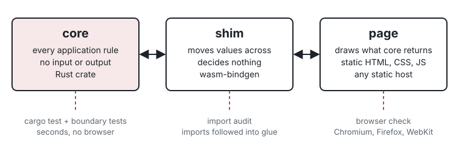

# Architecture

A Builder tool has three layers, and each one has a check that can see it.

## Core

`crates/core` is a Rust library that holds every application rule and state transition. It performs no browser, filesystem, network, clock, random-device or UI input or output, so `cargo test` reaches every rule without launching a browser. Public functions take ordinary values and return ordinary values or serialisable structures. The template's convention is one module, `api.rs`, whose functions take strings and return `{"ok": ...}` or `{"error": "..."}` as JSON text. An error carries the message the page will show, so the wording of a rule's failure sits beside the rule.

The core's dependencies are on an allowlist in `crates/core/tests/boundary.rs`. The reference default is `serde` and `serde_json`, and the reference default also bans floats, hash maps, clocks and randomness so that the same input gives the same output on every machine.

## Shim

`crates/shim` uses `wasm-bindgen` to expose the core to the page. Each exported function converts its arguments, makes one call into the core, and returns the result. The boundary test fails if a branch, a loop, a `match` or the `?` operator appears in the shim's source.

The rule exists because a decision made in the shim is a decision the fast suite cannot reach. One of the seven tools behind Builder grew a shim of several thousand lines, and during play a barrel "showed one thing and sold another" because the shim performed its own lookup. With the rule in the core, there is one rulebook and the tests read it.

Core and shim compile into one WebAssembly module. `wasm-bindgen` pairs it with a JavaScript glue file that loads it. The module reaches the page only through its imports, so listing the imports and following each into the glue shows what the compiled code can reach (`scripts/wasm_imports.py`).

## Page

`web/` is plain HTML, CSS and JavaScript with no framework, bundler or package manager. It loads the module, fetches its content from `data/` on its own origin, passes values to the shim, and draws what comes back. It does not recompute an application rule.

Some state is presentation, and the page may keep it: which panel is open, focus, scroll position, an animation's timing, and the last value the core returned, which the page hands back on the next call. When it is not obvious whether something is presentation or a rule, ask whether a test of the tool's behaviour would need it. If it would, it belongs in the core.

The page sets a Content-Security-Policy in a meta element (reference default). The policy allows WebAssembly with `'wasm-unsafe-eval'`, keeps connections on the origin with `connect-src 'self'`, and blocks form posts with `form-action 'none'`. A meta policy cannot stop a page sending data away by navigating, so the browser check still watches every request.

## Data

Reader-visible text and content live in `data/` (reference default). Content changes without touching a rule, and a copy audit can read every string in one place.

## What sits outside the default build

A feature that needs a server, a live model, accounts, or shared state between people's devices does not fit the default build, whose finished form is static files with no off-origin request on load. Such a feature needs its own design, checks and approvals. [`adoption.md`](adoption.md) says more.
